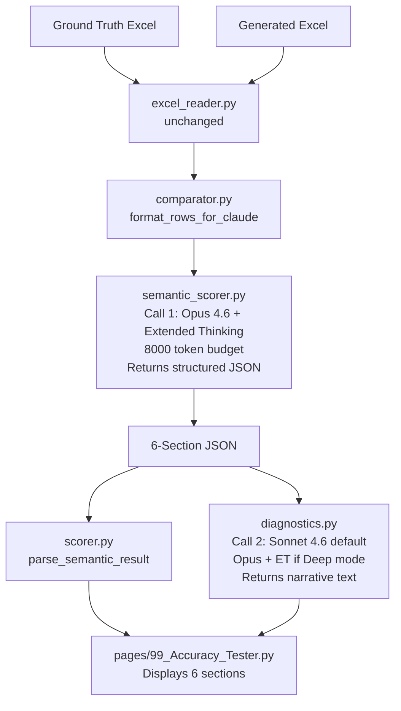

# Accuracy Tester Output Specification Refactor

## Architecture Overview




## JSON Schema (Call 1 output)

```json
{
  "section1": {
    "missed_skus": [{"sku_id": "...", "brand": "...", "product_name": "...", "packaging_size_ml": null}],
    "hallucinated_skus": [{"sku_id": "..."}],
    "matched_count": 12,
    "total_gt_count": 15,
    "completeness_score_pct": 80.0
  },
  "section2": {
    "shelf_level":          {"correct": 10, "incorrect": 2, "accuracy_pct": 83.3},
    "number_of_shelf_levels": {"correct": 11, "incorrect": 1, "accuracy_pct": 91.7},
    "facings":              {"correct": 9,  "incorrect": 3, "accuracy_pct": 75.0},
    "price":                {"correct": 10, "incorrect": 2, "accuracy_pct": 83.3},
    "packaging_size_ml":    {"correct": 12, "incorrect": 0, "accuracy_pct": 100.0}
  },
  "section3": {
    "is_private_label":          {"correct": 11, "incorrect": 1, "accuracy_pct": 91.7},
    "is_branded_private_label":  {"correct": 10, "incorrect": 2, "accuracy_pct": 83.3},
    "product_type": {
      "correct": 9, "incorrect": 3, "accuracy_pct": 75.0,
      "flagged": [{"sku_id": "...", "gt_value": "...", "generated_value": "...", "reason": "..."}]
    }
  },
  "section4": {
    "extraction_method": {"correct": 8, "incorrect": 4, "accuracy_pct": 66.7},
    "processing_method":  {"correct": 10, "incorrect": 2, "accuracy_pct": 83.3},
    "hpp_treatment":      {"correct": 11, "incorrect": 1, "accuracy_pct": 91.7},
    "packaging_type":     {"correct": 9,  "incorrect": 3, "accuracy_pct": 75.0}
  },
  "section5": {
    "overall_semantic_score_pct": 85.0,
    "product_name_score_pct": 88.0,
    "flavor_score_pct": 82.0,
    "brand_score_pct": 91.0,
    "flagged_rows": [{"sku_id": "...", "field": "...", "gt_value": "...", "generated_value": "...", "reason": "..."}]
  },
  "section6": [
    {"sku_id": "...", "field": "...", "gt_value": "...", "generated_value": "...", "severity": "critical"}
  ]
}
```

## Field Mappings (spec name → schema key)

- `price` → `price_local`
- `number_of_shelf_levels` → `shelf_levels`
- `extraction_method` → `juice_extraction_method`
- `is_private_label` / `is_branded_private_label` → Claude infers semantically from `branded_private_label` text

## Files to Change

### New: `[accuracy_tester/semantic_scorer.py](accuracy_tester/semantic_scorer.py)`

- `run_semantic_scoring(gt_rows, gen_rows, api_key) -> dict` — Call 1
- Model: `claude-opus-4-6`, Extended Thinking, `budget_tokens=8000`, `max_tokens=16000`
- Prompt instructs Claude to: (1) semantically match SKUs, (2) score all 6 sections exactly per spec, (3) return **only** valid JSON matching the schema above
- `is_private_label` / `is_branded_private_label` scoring instructions: interpret `branded_private_label` field — "Private Label" ↔ `is_private_label=True`, "Branded Private Label" ↔ `is_branded_private_label=True`, "Branded" ↔ both False
- Price tolerance: within £0.01/€0.01 counts as correct
- `SemanticScoreResult` dataclass wrapping the parsed JSON dict

### Modified: `[accuracy_tester/comparator.py](accuracy_tester/comparator.py)`

- Remove all matching/diffing logic
- Keep only: `format_rows_for_claude(rows: list[dict]) -> list[dict]` — filters out metadata/formula/non-scoring columns and returns cleaned row list ready to JSON-serialise for Call 1

### Modified: `[accuracy_tester/scorer.py](accuracy_tester/scorer.py)`

- Remove all scoring logic
- Keep only: `parse_semantic_result(raw: dict) -> SemanticScoreResult` and display helper `get_flagged_table(result: SemanticScoreResult) -> list[dict]`

### Modified: `[accuracy_tester/diagnostics.py](accuracy_tester/diagnostics.py)`

- Repurpose for Call 2 only
- `run_narrative_diagnosis(semantic_result: dict, api_key: str, deep: bool) -> str`
  - `deep=False`: Sonnet 4.6, no extended thinking (default)
  - `deep=True`: Opus 4.6, Extended Thinking 8000 tokens
- Prompt receives the full JSON from Call 1 and produces a human-readable narrative covering patterns, root causes, and improvement suggestions

### Modified: `[pages/99_Accuracy_Tester.py](pages/99_Accuracy_Tester.py)`

- Sections 1–4 of the existing page (metadata, photos, GT upload, run pipeline) — unchanged
- Replace old "5. Accuracy Results" with new **Sections 1–6** display:
  - **Section 1**: metrics row (`st.metric`) + two expandable lists (missed / hallucinated SKUs)
  - **Section 2**: styled table (green ≥ 90%, amber ≥ 70%, red < 70%) for 5 critical fields
  - **Section 3**: styled table for 3 classification fields; `product_type` flagged entries shown below
  - **Section 4**: styled table for 4 extraction method fields
  - **Section 5**: semantic quality score gauge + expandable flagged rows
  - **Section 6**: full flagged rows table with red (`critical`) / amber (`warning`) row highlighting
- Replace old "6. Claude Diagnostic" with new **Narrative Diagnosis** panel:
  - Call 2 runs as before with Quick/Deep toggle
  - Deep toggle now clearly labelled "applies to narrative only — scoring always uses Opus Extended Thinking"

